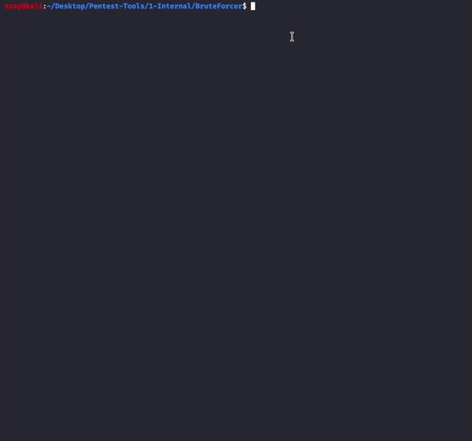

# BruteForcer
You can do brute force attacks automatically with this script. 

<b>Just Run and Wait For Results.</b>
## Installation
Clone the git and you pretty much ready to roll

```
git clone https://github.com/eraycakinn/BruteForcer.git
cd BruteForcer/
sudo chmod +x BruteForcer.sh Parser/ultimate-nmap-parser.sh
sudo ./BruteForcer.sh <target> or <targets_file>
```
## How to Run


When script finished, You will get Outputs Files. All Results in there.

## Features
-- Live Hosts in ALL network (Nmap)<br>
-- Open Ports in ALL network (Nmap)<br>
-- Brute Force Attacks to Popular ports (Nmap Output Open Ports)<br>
(If port is close for scanning host, script won't do brute force attack.) <b>**Time is Important :)</b>

## Which results can you get ? 
### Outputs File Hierarchy
<ul>
  <li>Scans
  <ul>
    <li>livehosts</li>
    <li>nmap_result</li>
   </ul>
  </li>
  <li>Brute_Result
  <ul>
    <li>(protocol-name)_result.txt</li>
  </ul>
  </li>
</ul> 
Note: If Brute Force Attack fails for any port, Result file will not save. It's more readable. Right.<br>

### Output Demo

